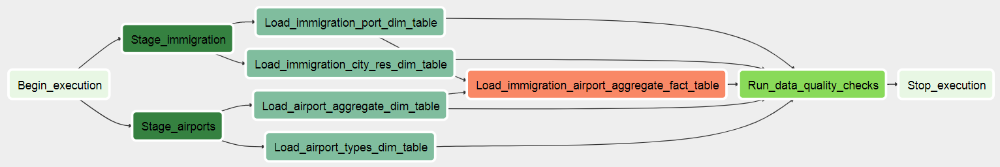

# Immigration & Airport Data

## Project Summary
**Aggregate the immigration data by airport in order to find out the relationship between the number of immigrants and the airports.**

Data stored in S3 bucket `s3a://immigration-airport-data/`

The project follows the follow steps:
1. [Project Scope](README.md#Project-Scope)
1. [Data Exploration](README.md#Data-Exploration)
1. [Data Model](README.md#Data-Model)
1. [ETL](README.md#ETL)
1. [Data Quality Check](README.md#Data-Quality-Checks)
1. [Data Dictionary](README.md#Data-Dictionary)
1. [Scenarios](README.md#Scenarios)

## Project-Scope

### Scope 
- Aggregate the immigration data by airport in order to find out the relationship between the number of immigrants and the airports.

### Data Source
1. (New) Airport codes data downloaded from https://datahub.io/core/airport-codes
    - 6 different types of airports
    - Location for each type of airport in the area
1. Immigration data from i94 https://travel.trade.gov/research/reports/i94/historical/2016.html
    - 12 files for each month, each with around **3 million rows**
    - Contains each immigrant entry port and basic information

### Solution
- Aggregated data partitioned by year and month the total immigrants and number of airports in each city.

### Technical Tools
- Jupyter Notebook (Python): Test code to read/process airport/immigration files and read/write parquet files using PySpark
- Spark: PySpark was used to read and process the data (each month of immigration data has ~3 million rows)
  - Saving the files in S3 by partitioning the parquet files allows for faster processing speed
  - Reading/writing as parquet (columnar) greatly increase efficiency when cleaning and aggregating data
- AWS: Used S3 to store and save data, easily scalable, cheap

## Data-Exploration
### Airport Data
- Aggregate airport types by city

#### Feature Engineer
- Split the region columns to show both country and state separately
- Pivot table to show aggregation of types of airports in each location

#### Clean data
- Remove Null values from column municipality
- Make sure data type fit schema
- Check for null values in Primary Key and Not Null columns

#### Create module to convert i94 immigration codes
- `port_codes_dict`: convert port codes to port names
- `city_res_codes_dict`: convert city & res code to names

### Immigration Data
- Aggregate immigrants by port, city, res

#### Feature Engineer
- Convert all port, city, res codes to names
- Split the port names to city and state

#### Clean data
- Make sure data type fit schema
- Check for null values in Primary Key and Not Null columns

## Data-Model
In order to have a holistic view of how many immigrants are coming to each port, we would group the data by the port location. We have two parts of aggregation, starting where immigrants left and their destination. Next we have airports data, each location has multiple types of airports. To have one row represents each location as well as the types of airports, we pivot the table to aggregate how many types of airports each location has. Finally, we join the immigration_port and airport_aggregate tables to have the final table showing how many immigrants arrived at each port and how many airports are in the same location.

### Fact Table
- `immigration_airport_aggregate`
  - stores the number of immigrants in each port for each month of the year
  - also shows the number of different types of airports for each location

### 4 Dimension Tables
- `airport_types`: shows the location and types of airports in each city
- `airport_aggregate`: stores the number of types of airports in each city
- `immigration_city_res`: stores the number of immigrants coming from a given city
- `immigration_port`: stores the number of immigrants to each port

## ETL
- The data should be updated monthly given how the the data is aggregated monthly.

1. Stage immigration and airport data
1. Load and transform data immigration_port, immigration_city_res, airport_types, airport_aggregation table
1. Create new table by joining immigration_port and airport_aggregation tables
1. Check data quality

## Data-Quality-Checks
- Drop any null values in columns that are Primary Key or Not Null columns
- Check for null values to make sure data is clean
- Set data types correctly to fit schema

## Data-Dictionary
- Airport data from https://datahub.io/core/airport-codes
- Immigration data from https://travel.trade.gov/research/reports/i94/historical/2016.html

### airport_types
| Field         | Type    | Contraints |
|---------------|---------|------------|
| continent     | varchar | PK         |
| country       | varchar | PK         |
| state         | varchar | PK         |
| municipality  | varchar | PK         |
| type          | varchar | NOT NULL   |
| name          | varch   | NOT NULL   |
| latitude_deg  | float   |            |
| logitutde_deg | float   |            |
| elevation_ft  | float   |            |

### airport_aggregate
| Field          | Type    | Contraints |
|----------------|---------|------------|
| country        | varchar | PK         |
| state          | varchar | PK         |
| municipality   | varchar | PK         |
| ballonport     | int     |            |
| heliport       | int     |            |
| large_airport  | int     |            |
| medium_airport | int     |            |
| seaplane_base  | int     |            |
| small_airport  | int     |            |

### immigration_city_res
| Field     | Type    | Contraints |
|-----------|---------|------------|
| year      | int     | PK         |
| month     | int     | PK         |
| i94res    | int     | PK         |
| i94cit    | int     | PK         |
| count     | int     | NOT NULL   |
| city_name | varchar |            |
| res_name  | varchar |            |

### immigration_port
| Field     | Type    | Contraints |
|-----------|---------|------------|
| year      | int     | PK         |
| month     | int     | PK         |
| i94port   | int     | PK         |
| count     | int     | NOT NULL   |
| port_name | varchar |            |

### immigration_airport_aggregate
| Field          | Type    | Contraints |
|----------------|---------|------------|
| year           | int     | PK         |
| month          | int     | PK         |
| i94port        | int     | PK         |
| i94_count      | int     | NOT NULL   |
| port_name      | varchar |            |
| city           | varchar |            |
| state          | varchar |            |
| small_airport  | int     |            |
| medium_airport | int     |            |
| large_airport  | int     |            |
| seaplane_base  | int     |            |
| heliport       | int     |            |
| balloonport    | int     |            |

## Scenarios

### The data was increased by 100x
Depending on the required time limit, additional nodes may be required and EMR should be used to process the huge amount of data in the desired time. Additional S3 buckets might be needed if data are reaching the limit.

### The pipelines would be run on a daily basis by 7 am every day
Schedule Airflow DAG to trigger the pipeline everyday at 7am.

### The database needed to be accessed by 100+ people
Create a specific IAM for people that needs to access the S3, make sure the S3 bucket is created as a normal and not glacier S3 as that would slow the speed significantly.

## Set-up
- Make sure to set up AWS credentials to connect to S3 buckets
